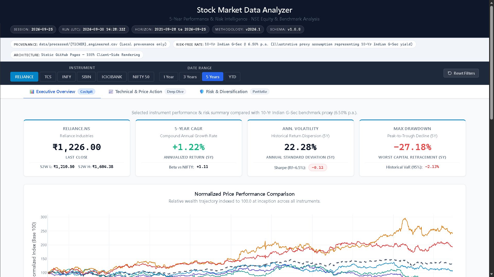
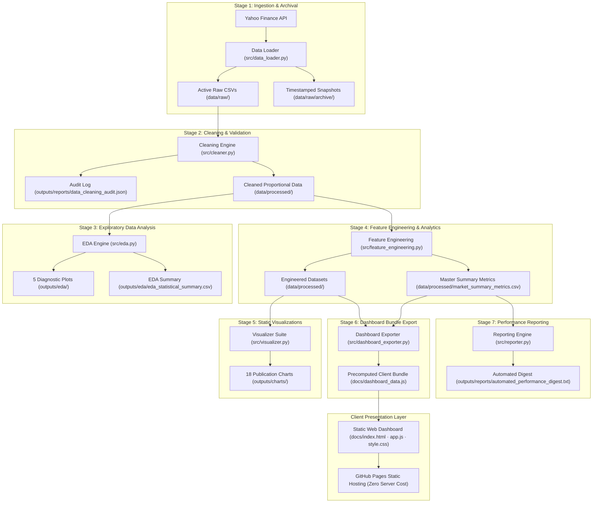

<div align="center">

# STOCK MARKET DATA ANALYZER

### **Enterprise Quantitative Financial Analytics Pipeline & Interactive Executive Web Intelligence Platform**

**Institutional-Grade Equity Analysis Engine with Interactive 3-Tab Corporate Executive Dashboard, Multi-Period Risk Modeling & Zero-Trust Client Separation**

[](#)
[](https://www.python.org/)
[](https://pandas.pydata.org/)
[](https://numpy.org/)
[](https://scipy.org/)
[](https://plotly.com/javascript/)
[](https://matplotlib.org/)
[](tests/)
[](#)
[](https://girishshenoy16.github.io/stock-market-data-analyzer/)

---

A production-grade quantitative financial engineering pipeline and interactive executive intelligence platform designed to evaluate multi-year risk-adjusted returns, factor dynamics, and tail risks across India's premier equity universe and the benchmark NIFTY 50 index over a 5-year investment cycle (September 2021 to September 2026). The platform features an immutable single-source-of-truth data lineage, defensive corporate action adjustments, deterministic multi-period precomputations (5Y, 3Y, 1Y, YTD), and an interactive corporate web dashboard deployed serverlessly via GitHub Pages with zero runtime server costs.

[**Live Dashboard**](https://girishshenoy16.github.io/stock-market-data-analyzer/) | [**Project Report**](reports/PROJECT_REPORT.md) | [**Executive Summary**](reports/EXECUTIVE_SUMMARY.md)

---

## 1. Live Demo and Dashboard Preview

[](https://girishshenoy16.github.io/stock-market-data-analyzer/)

*Executive Corporate Intelligence Dashboard — Interactive 3-Tab Analytics Platform deployed via GitHub Pages*

| Tab 1: Executive Overview | Tab 2: Technical & Price Action | Tab 3: Risk & Diversification |
|:---:|:---:|:---:|
| Benchmark-first scorecard, 5 KPI cards, multi-period risk matrix & relative performance | OHLC candlestick engine, Bollinger Bands (±2σ), Wilder's RSI-14 & volume bars | Multi-asset correlation heatmap, rolling 30-day volatility & underwater drawdown profiles |

👉 **[Access the Live Stock Market Data Analyzer Dashboard](https://girishshenoy16.github.io/stock-market-data-analyzer/)**

</div>

---

## 2. Project Statistics

<div align="center">

| Metric / Dimension | Verified System Value | Technical & Methodological Specification |
|:---|:---:|:---|
| **Target Asset Universe** | **6 Instruments** | 5 Equities (`RELIANCE.NS`, `TCS.NS`, `INFY.NS`, `SBIN.NS`, `ICICIBANK.NS`) + 1 Benchmark (`^NSEI` / NIFTY 50) |
| **Historical Horizon** | **5 Calendar Years** | September 28, 2021 to September 25, 2026 (4.9911 Calendar Years Duration) |
| **Trading Intervals** | **1,239 Daily Intervals** | 1,240 OHLCV bars for Equities; 1,235 bars for `^NSEI` (exchange holiday differential validated) |
| **Ingested Market Records** | **7,429 Cleaned Bars** | 100% accounting reconciliation across all 6 raw-to-processed historical series |
| **Pipeline Architecture** | **7 Sequential Stages** | Centralized, fail-fast orchestrator (`main.py`) with atomic disk writes and execution timer |
| **Dashboard Architecture** | **3 Corporate Tabs** | Tab 1: Executive Overview · Tab 2: Technical & Price Action · Tab 3: Risk & Diversification |
| **Precomputed Horizons** | **4 Lookback Periods** | 5-Year (5Y), 3-Year (3Y), 1-Year (1Y), and Year-to-Date (YTD) precomputed in Python |
| **Benchmark Integrity** | **Pinned Row 1** | NIFTY 50 permanently anchored to Row 1 with neutral styling across all metric sorts |
| **Static Visualizations** | **23 Figures (300 DPI)** | 18 asset-specific multi-panel figures (`outputs/charts/`) + 5 diagnostic EDA plots (`outputs/eda/`) |
| **Risk-Free Rate Benchmark**| **6.50% p.a.** | 10-Yr Indian G-Sec compounded daily: $R_{f,\text{daily}} = (1 + 0.065)^{1/252} - 1 \approx 0.025001\%$ |
| **Automated Test Coverage** | **52 Total Tests** | Default Offline: 51 Passed, 1 Skipped · Live Integration: 1 Passed (via `RUN_LIVE_TESTS=1`) |
| **Browser E2E Verification**| **38/38 CDP Checks** | Automated Chrome DevTools Protocol verification with 0 console errors and 0px horizontal overflow |
| **Static Web Hosting Cost** | **$0 / month** | 100% static, serverless deployment on GitHub Pages (`docs/`) with zero backend maintenance |

</div>

---

## 3. Executive Overview and Problem Statement

### The Problem
Evaluating multi-year investment dynamics across emerging markets presents key data engineering and statistical challenges:
* **Corporate Action Price Cliffs:** Stock splits, bonus shares, and dividends introduce artificial price discontinuities (e.g., an unadjusted 2:1 split appears as a false -50% crash).
* **Calendar Alignment & Holiday Gaps:** Blind forward-filling (`ffill`) across exchange closures artificially dampens return variance, creating falsified volatility and Sharpe estimates.
* **Partial-Window Warmup Bias:** Rolling indicators (52-week corridors, 200-day SMAs) computed without lead-in periods produce distorted early signals.
* **Client Divergence & Hosting Costs:** Dynamic Python web servers (Streamlit/Dash) introduce cold starts, ongoing cloud costs, and in-browser calculation discrepancies against back-office models.

### How This Project Solves These Issues

1. **Proportional Factor Adjustment:** Calculates daily adjustment scalar $f_t = \frac{\text{Adj Close}_t}{\text{Close}_t}$ and scales Open, High, and Low proportionately, preserving candlestick geometry.
2. **Calendar Gap Preservation:** Natural exchange holidays are preserved; multi-asset alignment is strictly enforced via inner joins, avoiding artificial zero-return days.
3. **Strict 251-Day Warmup:** Rolling 52-week corridors explicitly assign `NaN` across the first 251 trading bars, eliminating premature indicator triggers.
4. **Single Source of Truth & Zero Runtime Math:** Python precomputes all metrics into a versioned bundle (`docs/dashboard_data.js`). The web UI performs **zero financial calculations**, serving serverlessly via GitHub Pages for $0/month.

---

## 4. Key Features

### 4.1 Tab 1 — Executive Overview Dashboard
* **Dynamic Metric Cards:** Displays Last Close, 5Y CAGR, Annualized Volatility, Sharpe Ratio ($R_f=6.5\%$), and Maximum Drawdown upon instrument selection.
* **Multi-Period Horizon Slicer:** Global lookback selector supporting **5Y**, **3Y**, **1Y**, and **YTD** views with synchronized chart updates.
* **Normalized Performance Chart:** Re-indexes all instruments to a 100.0 baseline at inception for direct relative growth comparisons.
* **Canonical Benchmark-First Table:** Permanently anchors NIFTY 50 (`^NSEI`) to Row 1 with neutral styling across all column sorts, with dynamic period-sensitive metric headers and a 1-click Reset Filters button.

### 4.2 Tab 2 — Technical & Price Action Analysis
* **Instrument Slicer:** Instant switching across all 5 equities and the NIFTY 50 benchmark.
* **High-Resolution OHLC Candlestick Engine:** Interactive Plotly.js price bars synchronized with daily volume bars and volume SMA-20.
* **Technical Overlays:** Toggleable **SMA-20**, **SMA-50**, **SMA-200**, **EMA-20**, and **Bollinger Bands** (20-day $\pm 2\sigma$).
* **Wilder's RSI-14 Momentum Oscillator:** Synchronized secondary panel with 70/30 overbought/oversold indicator thresholds.

### 4.3 Tab 3 — Risk & Diversification Intelligence
* **Cross-Asset Correlation Heatmap:** Complete-case Pearson correlation matrix across all 6 instruments.
* **Rolling 30-Day Volatility:** Multi-asset annualized volatility regime tracking over time.
* **Underwater Drawdown Profiles:** Peak-to-trough capital erosion area charts with historical recovery tracking.
* **Tail Risk & Sensitivity KPIs:** Historical Value at Risk (VaR 95%) and Market Beta sensitivity relative to NIFTY 50.

### 4.4 Automated Pipeline Orchestration CLI (`main.py`)
* **7 Sequential Stages:** Ingestion, cleaning, EDA, feature engineering, static charting, web data export, and digest generation.
* **Guaranteed Offline Execution (`--skip-download`):** Runs the full pipeline locally using cached data with zero network requests.
* **Idempotent Re-Run Flag (`--re-run`):** Safely recomputes all downstream analytics and visual artifacts.

---

## 5. Master Empirical Performance Scorecard (2021–2026)

| Instrument         | Asset Classification          |    Last Close     |  5-Yr CAGR  | Ann. Volatility | Sharpe Ratio ($R_f=6.5\%$) | Max Drawdown | VaR (95%)  | Beta vs NIFTY | 52W Position |
|:-------------------|:------------------------------|:-----------------:|:-----------:|:---------------:|:--------------------------:|:------------:|:----------:|:-------------:|:------------:|
| **`^NSEI`**        | **National Benchmark Index**  | **23,140.50 pts** | **+5.46%**  |   **13.81%**    |         **+0.01**          | **-17.23%**  | **-1.39%** |   **1.00**    |  **22.9%**   |
| **`SBIN.NS`**      | Public Sector Banking         |      ₹983.00      | **+19.33%** |     24.51%      |         **+0.60**          |   -23.94%    |   -2.21%   |     1.16      |    38.7%     |
| **`ICICIBANK.NS`** | Private Sector Banking        |     ₹1,326.80     | **+14.00%** |     20.15%      |         **+0.45**          |   -22.33%    |   -1.85%   |     0.97      |    51.4%     |
| **`RELIANCE.NS`**  | Energy & Telecom Conglomerate |     ₹1,226.00     | **+1.22%**  |     22.28%      |         **-0.12**          |   -27.18%    |   -2.13%   |     1.11      |     3.9%     |
| **`INFY.NS`**      | IT Services & Consulting      |     ₹1,000.20     | **-7.42%**  |     25.96%      |         **-0.41**          |   -48.17%    |   -2.61%   |     0.97      |     2.5%     |
| **`TCS.NS`**       | IT Services & Consulting      |     ₹2,082.00     | **-8.72%**  |     22.58%      |         **-0.58**          |   -53.39%    |   -2.11%   |     0.81      |     8.8%     |

### Key Empirical Findings
1. **Banking Hegemony:** State Bank of India (+19.33% CAGR, +0.60 Sharpe) and ICICI Bank (+14.00% CAGR, +0.45 Sharpe) significantly outperformed the market, driven by balance sheet de-leveraging and expanded net interest margins.
2. **IT Valuation Compression:** Following late-2021 highs, TCS (-8.72% CAGR) and Infosys (-7.42% CAGR) experienced sustained multiple compression and severe drawdowns (-53.39% and -48.17%) from discretionary IT budget cuts.
3. **Conglomerate CapEx Cycle:** Reliance Industries (+1.22% CAGR) lagged the 6.50% sovereign hurdle (Sharpe -0.12), reflecting heavy capital expenditures across 5G, retail, and clean energy.
4. **Index Diversification Advantage:** The NIFTY 50 cut individual equity volatility roughly in half (13.81% vs. 20.15%–25.96%) and limited drawdown to -17.23%, demonstrating clear downside preservation.

---

## 6. Technology Stack

| Technical Domain             | Technology / Library     |     Version     | Operational Function & Rationale                                                        |
|:-----------------------------|:-------------------------|:---------------:|:----------------------------------------------------------------------------------------|
| **Language & Runtime**       | Python                   |     3.11.9+     | Core data processing pipeline, financial mathematics, and master CLI orchestrator       |
| **Tabular Data Processing**  | Pandas                   |      3.0.6      | Time-series manipulation, rolling computations, and data cleaning                       |
| **Vectorized Math**          | NumPy                    |      2.4.6      | High-performance vectorized arithmetic and logarithmic returns                          |
| **Statistical Computations** | SciPy                    |     1.17.1      | Covariance modeling, percentile distributions, and correlation estimation               |
| **Market Data Ingestion**    | yfinance                 |     0.2.66      | Historical daily OHLCV ingestion with retry logic and caching                           |
| **Static Visualizations**    | Matplotlib & Seaborn     | 3.11.2 / 0.13.2 | Production of 23 publication-grade 300 DPI figures (`outputs/charts/` & `outputs/eda/`) |
| **Interactive Client UI**    | HTML5, CSS3, ES6+        |   Modern Web    | Accessible executive layout with responsive CSS Grid and semantic markup                |
| **Client Charting Engine**   | Plotly.js CDN            |     2.35.2      | High-performance interactive candlestick rendering, line charts, and heatmaps           |
| **Automated Testing Suite**  | Pytest                   |      8.4.2      | Hermetic unit, integration, and orchestration test harness                              |
| **Browser E2E Verification** | Chrome DevTools Protocol |       CDP       | Headless visual auditing, console error detection, and viewport overflow assertions     |
| **Static Web Hosting**       | GitHub Pages             |   Serverless    | $0/month static hosting directly from the repository's `docs/` directory                |

---

## 7. System Architecture



---

## 8. Installation and Quickstart

### Prerequisites
* Python `3.11.x` (verified on Python 3.11.9)
* Git & Modern Web Browser (Chrome, Edge, Firefox, Safari)

### Quickstart Setup

```powershell
# 1. Clone repository and navigate to directory
git clone https://github.com/girishshenoy16/stock-market-data-analyzer.git
cd stock-market-data-analyzer

# 2. Create and activate virtual environment (Windows PowerShell)
python -m venv venv
.\venv\Scripts\Activate.ps1
# On macOS/Linux: source venv/bin/activate

# 3. Install pinned dependencies
pip install -r requirements.txt
```

### Running the Pipeline

```powershell
# 1. 100% Offline Pipeline (uses cached data, zero network calls)
python main.py --skip-download

# 2. Complete Live Execution (downloads fresh market data from Yahoo Finance)
python main.py

# 3. Forced Idempotent Rerun (recomputes all analytics offline)
python main.py --re-run --skip-download

# 4. Verbose Logging Mode
python main.py --skip-download --verbose
```

### Running Tests & Previewing Dashboard

```powershell
# Run default offline test suite (51 passed, 1 skipped)
python -m pytest -v

# Run gated live network test (requires internet)
$env:RUN_LIVE_TESTS="1"; python -m pytest tests/live_integration/test_live_yfinance.py -v

# Preview interactive web dashboard locally
python -m http.server 8000 -d docs
# Open http://localhost:8000 in your browser
```

---

## 9. Folder Structure

```text
Stock Market Data Analyzer/
├── data/
│   ├── raw/                           # Active raw downloads from Yahoo Finance
│   └── processed/                     # Cleaned, engineered datasets & master metrics
├── docs/                              # Static GitHub Pages web dashboard
│   ├── index.html                     # Semantic 3-tab executive dashboard markup
│   ├── style.css                      # Corporate styling & responsive layout
│   ├── app.js                         # Benchmark-first controller & Plotly.js renderer
│   └── dashboard_data.js              # Precompiled client data bundle (Schema v1.0.0)
├── logs/                              # Pipeline execution logs 
├── outputs/                           # Pipeline analytical deliverables
│   ├── charts/                        # 18 static publication-grade 300 DPI figures
│   ├── eda/                           # 5 diagnostic plots & statistical summary CSV
│   └── reports/                       # Automated text digests & data cleaning audits
├── reports/                           # Formal executive & technical documentation
│   ├── EXECUTIVE_SUMMARY.md           # Strategic C-suite briefing
│   └── PROJECT_REPORT.md              # Comprehensive technical report
├── src/                               # Core Python analytics & engineering engine
│   ├── cleaner.py                     # Data validation & proportional OHLC scaling
│   ├── dashboard_exporter.py          # JavaScript data bundle compiler
│   ├── data_loader.py                 # Ingestion & timestamped snapshot archival
│   ├── eda.py                         # Exploratory distribution & correlation analysis
│   ├── feature_engineering.py         # Technical indicators & risk metrics calculation
│   ├── logger.py                      # Centralized rotating file logger
│   ├── reporter.py                    # Automated performance digest generator
│   └── visualizer.py                  # Publication-grade Matplotlib plotting suite
├── tests/                             # Automated Quality Assurance test harness
│   ├── fixtures/                      # Deterministic synthetic test CSV fixtures
│   ├── live_integration/              # Isolated live network test (gated)
│   └── test_*.py                      # Hermetic unit, feature, cleaner, and pipeline tests
├── main.py                            # Master pipeline orchestrator CLI
└── requirements.txt                   # Pinned dependency constraints
```

---

## 10. Quantitative Financial Methodology

### 10.1 Calendar-Duration CAGR
Annualized growth rate evaluates exact elapsed calendar duration rather than naive trading day counts:
$$\text{CAGR} = \left( \frac{P_{\text{end}}}{P_{\text{start}}} \right)^{\frac{1}{\Delta t_{\text{years}}}} - 1, \quad \text{where } \Delta t_{\text{years}} = \frac{\text{Date}_{\text{end}} - \text{Date}_{\text{start}}}{365.25} \approx 4.9911 \text{ years}$$

### 10.2 Proportional OHLC Adjustment Factor
Corporate actions (splits, bonuses, dividends) scale Open, High, and Low proportionately using daily adjustment factor $f_t$:
$$f_t = \frac{\text{Adj Close}_t}{\text{Close}_t}, \quad \text{Open}_{\text{adj}, t} = \text{Open}_t \cdot f_t, \quad \text{High}_{\text{adj}, t} = \text{High}_t \cdot f_t, \quad \text{Low}_{\text{adj}, t} = \text{Low}_t \cdot f_t$$

### 10.3 Annualized Sample Volatility (Bessel Corrected, $\text{ddof}=1$)
Daily log returns $r_t = \ln(P_t / P_{t-1})$ are converted to annualized volatility using sample variance:
$$\sigma_{\text{daily}} = \sqrt{\frac{1}{N - 1} \sum_{t=1}^N (r_t - \bar{r})^2}, \quad \sigma_{\text{annualized}} = \sigma_{\text{daily}} \times \sqrt{252}$$

### 10.4 Risk-Free Rate Proxy & Sharpe Ratio ($R_f = 6.50\%$)
The risk-free rate proxy is the 10-Yr Indian G-Sec benchmark ($R_{f,\text{annual}} = 6.50\%$). Daily compounding is derived:
$$R_{f,\text{daily}} = (1 + 0.065)^{\frac{1}{252}} - 1 \approx 0.025001\%, \quad \text{Sharpe Ratio} = \frac{\bar{r} - R_{f,\text{daily}}}{\sigma_{e}} \times \sqrt{252}$$

### 10.5 Market Beta Sensitivity vs NIFTY 50
Evaluates systematic covariance with the benchmark index on date-aligned valid trading days:
$$\beta_i = \frac{\text{Cov}(r_i, r_m)}{\text{Var}(r_m)} = \frac{\sum_{t=1}^K (r_{i,t} - \bar{r}_i)(r_{m,t} - \bar{r}_m)}{\sum_{t=1}^K (r_{m,t} - \bar{r}_m)^2}$$

### 10.6 Wilder's Smoothed RSI-14
Recursive exponential smoothing of upward gains ($U_t$) and downward losses ($D_t$):
$$\text{AvgGain}_t = \frac{\text{AvgGain}_{t-1} \times 13 + U_t}{14}, \quad \text{AvgLoss}_t = \frac{\text{AvgLoss}_{t-1} \times 13 + D_t}{14}, \quad \text{RSI}_t = 100 - \frac{100}{1 + \frac{\text{AvgGain}_t}{\text{AvgLoss}_t}}$$

### 10.7 Bollinger Bands ($\pm 2\sigma$)
$$\text{Middle Band}_t = \text{SMA}_{20}(P)_t, \quad \text{Upper/Lower Bands}_t = \text{Middle Band}_t \pm 2 \cdot \sigma_{20, t}$$

### 10.8 Rolling 52-Week Range & Warmup Rule
$$\text{High}_{52\text{W}, t} = \max_{0 \le i < 252} P_{t-i}, \quad \text{Low}_{52\text{W}, t} = \min_{0 \le i < 252} P_{t-i}$$
*Strict Warmup Rule*: The first 251 trading bars are explicitly assigned `NaN` to prevent partial-window distortion.

### 10.9 Underwater Maximum Drawdown (MDD)
$$\text{DD}_t = \frac{P_t - M_t}{M_t}, \quad M_t = \max_{s \le t} P_s, \quad \text{MDD} = \min_{t} \text{DD}_t$$

### 10.10 Historical Value at Risk (VaR 95%)
Non-parametric 5th percentile of the daily percentage return distribution:
$$\text{VaR}_{95\%} = \text{Percentile}(R_{\text{daily}}, 5)$$

---

## 11. Dashboard Architecture and Data Contracts

* **Zero Client-Side Math:** JavaScript ([`docs/app.js`](docs/app.js)) performs no financial calculations; all metrics are precalculated by Python into [`docs/dashboard_data.js`](docs/dashboard_data.js).
* **Static Payload Isolation:** Precomputed `window.STOCK_DASHBOARD_DATA` operates without runtime CSV fetching, eliminating CORS issues and enabling instantaneous static loading.
* **Canonical Benchmark Pinning:** NIFTY 50 (`^NSEI`) is permanently anchored to Row 1 of the Executive Summary Table across all column sorts to maintain a persistent market benchmark.
* **Period-Sensitive Dynamic Headers:** Selecting 1Y, 3Y, YTD, or 5Y dynamically switches table headers and metric values while preserving fixed structural metrics (Last Close, 5Y CAGR, 52W Range).
* **Plotly CDN Resilience:** Includes an inline fallback notice that gracefully informs users if external CDN script delivery fails while keeping non-Plotly UI functional.

---

## 12. Testing and Quality Assurance

| Test Suite Module                      | File Path                                      |    Checks     | Validated Requirements & Assertions                                                                           |      Status      |
|:---------------------------------------|:-----------------------------------------------|:-------------:|:--------------------------------------------------------------------------------------------------------------|:----------------:|
| **Mathematical Formulas & Indicators** | `tests/test_feature_engineering.py`            |      10       | Exact CAGR, Bessel $\text{ddof}=1$, compounded $R_f$, Sharpe, pairwise Beta, Wilder RSI-14, 251-day warmup    |     ✅ PASS      |
| **Pipeline Orchestrator & CLI**        | `tests/test_pipeline_orchestrator.py`          |      11       | Sequential 7-stage execution, fail-fast halting, `--skip-download` isolation, `--verbose` logging             |     ✅ PASS      |
| **Market Ingestion & Snapshots**       | `tests/test_data_loader.py`                    |       9       | MultiIndex column flattening, immutable snapshot archival, calendar break preservation                        |     ✅ PASS      |
| **Cleaning & Factor Adjustment**       | `tests/test_cleaner.py`                        |       6       | Non-positive price rejection, proportional factor scaling $f_t$, fallback factors, audit logging              |     ✅ PASS      |
| **Artifact & Contract Integrity**      | `tests/test_artifact_integrity.py`             |       6       | Single source of truth verification across CSVs and JSON, column schema consistency, NaN bounds               |     ✅ PASS      |
| **Dashboard Exporter & Bundle**        | `tests/test_dashboard_exporter.py`             |       3       | Versioned Schema v1.0.0 compliance, multi-period payload integrity, atomic file writes                        |     ✅ PASS      |
| **Reporting & Digest Generation**      | `tests/test_reporter.py`                       |       3       | Performance digest structure, canonical benchmark-first ordering, currency/percentage formatting              |     ✅ PASS      |
| **Exploratory Data Analysis**          | `tests/test_eda.py`                            |       2       | Statistical summary generation, 300 DPI distribution and correlation plot verification                        |     ✅ PASS      |
| **Static Visualization Suite**         | `tests/test_visualizer.py`                     |       1       | Multi-panel 300 DPI figure generation across all approved asset symbols                                       |     ✅ PASS      |
| **Live Network Connectivity**          | `tests/live_integration/test_live_yfinance.py` |       1       | Isolated live network check (gated via `RUN_LIVE_TESTS=1`; skipped by default)                                | ⏸️ SKIP / ✅ PASS |
| **Headless Browser CDP Suite**         | Chrome DevTools Protocol (CDP)                 |      38       | 38 visual and DOM checks: 0 console errors, 0 failed requests, 0px horizontal overflow across 6 viewports     |     ✅ PASS      |
| **Total Quality Assurance Layer**      | **Comprehensive System Verification**          | **90 Checks** | **100% Baseline: 51 Offline Passed, 1 Live Skipped (Passes with RUN_LIVE_TESTS=1), 38 Browser Checks Passed** |     ✅ PASS      |

> [!NOTE]
> The default offline test suite runs 100% hermetically without internet connectivity, reporting **51 passed, 1 skipped**. The single skipped test (`test_live_yfinance.py`) is an intentionally isolated live network check that executes and passes when `RUN_LIVE_TESTS=1` is explicitly set.

---

## 13. Limitations and Future Scope

### Limitations & Assumptions
* **Constant Risk-Free Rate:** Adopts fixed $R_f = 6.50\%$ proxy (10-Yr Indian G-Sec); does not model historical daily yield curve fluctuations.
* **Universe Selection:** Curated portfolio of 5 blue-chip equities + NIFTY 50; findings reflect large-cap resilience and do not generalize to small/mid-caps.
* **Batch Analytics:** Engineered for end-of-day portfolio auditing and strategic allocation rather than high-frequency intraday trading.
* **Zero Forecast Guarantee:** Historical risk-adjusted metrics evaluate past performance and do not predict future market returns.

### Future Scope & Roadmap
* **Dynamic Sovereign Yield Curves:** Ingest RBI historical yield curves for time-varying daily Sharpe ratio calculations.
* **Multi-Factor Risk Models:** Implement Fama-French 3-factor and Carhart 4-factor regressions.
* **CI/CD Automation:** Automated GitHub Actions workflows for scheduled data ingestion and test verification.
* **Options & Volatility Surface:** Incorporate NSE implied volatility (IV) and Put-Call Ratio (PCR) analytics.

---

## 14. Reports and Documentation

<div align="center">

| Deliverable Document                | Relative Path                                                                                          | Target Audience                 | Primary Contents & Focus                                                                      |
|:------------------------------------|:-------------------------------------------------------------------------------------------------------|:--------------------------------|:----------------------------------------------------------------------------------------------|
| **Authoritative Technical Report**  | [`reports/PROJECT_REPORT.md`](reports/PROJECT_REPORT.md)                                               | Technical Reviewers & Mentors   | Comprehensive report: mathematical proofs, data dictionary, architecture & tests              |
| **Strategic Executive Summary**     | [`reports/EXECUTIVE_SUMMARY.md`](reports/EXECUTIVE_SUMMARY.md)                                         | Investment Committees & C-Suite | Strategic executive briefing, sector rankings, capital compounding & drawdown analysis        |
</div>

---

## 15. Contact and License

### Author Contact

<div align="center">

**Girish Shenoy**

[](https://github.com/girishshenoy16)
[](https://linkedin.com/in/girishshenoys)
[](mailto:girishpshenoy09@gmail.com)

</div>

### Software License & Attribution
* **Software:** Released under the **MIT License** — Copyright (c) 2026 Girish Shenoy.
* **Market Data Attribution:** Historical Indian equity records sourced via Yahoo Finance (`yfinance`) referencing the National Stock Exchange of India (NSE).
* **Statutory Academic Disclaimer:** Engineered strictly for **educational, academic research, and quantitative portfolio evaluation purposes**. Does not constitute investment, financial, legal, or tax advice.

---

<div align="center">

**Engineered with quantitative rigor. Validated for institutional clarity. Documented for professional excellence.**

Stock Market Data Analyzer v2026.1 — A Python & Vanilla Web Quantitative Finance Application

</div>
